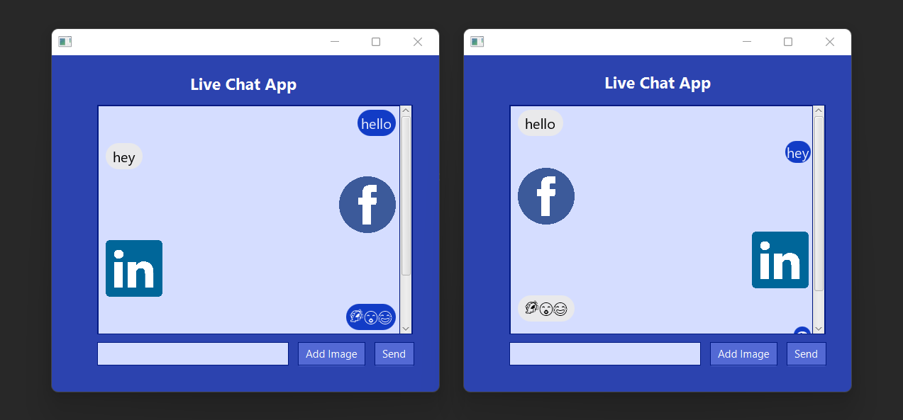

<h2 align="center">Live Chat App</h2>

This project was created for the network programming module 

Here, a chat app that can be used by several clients at the same time was created 

<h2 align="left">Process:</h2>

Users can log into the chat room using his/her name

A user can send a message from the interface that he/she has. (May use Unicode characters, emojis, or images to send messages)

Other users can simultaneously receive that message and see it in theirinterface

Users see the sender of the message and can respond to the messages accordingly

<h2 align="left">System Requirements:</h2>

Users can send or receive messages

The chat should update with every message sent simultaneously with all the users

The messages can contain text, Unicode characters, emojis, and images

The chat interface can be minimized until it is needed to avoid disturbancesto the work of the users

## <h2 align="left">Languages / Frameworks / Tools / Others:</h2>
* Java
* JavaFx
* Multi Threading
* Socket Programming
* MVC 

## <h2 align="left">Sample Screen Shots:</h2>

